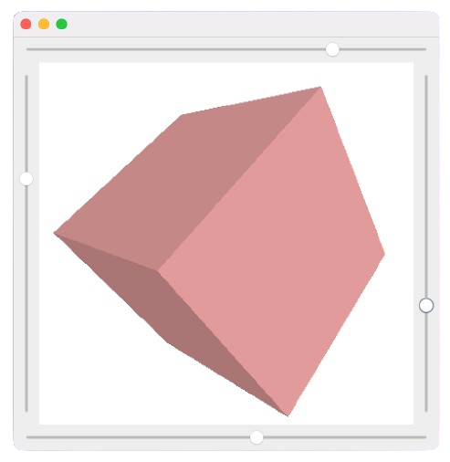

# 3D Rendering in Java

### TODO:

- [ ] remove sliders in favor of mouse/touch controls.

## Overview

The `Main` class sets up a Swing JFrame with sliders to control various aspects of the 3D rendering, such as heading (horizontal rotation), pitch (vertical rotation), roll, and field of view (FoV). The rendering is done in a custom JPanel (`renderPanel`) using Java2D.

## Usage

1. Clone the repository.
2. Open the project in your Java IDE.
3. Run the `Main` class.
4. Adjust the sliders to move around.

## Rendering Algorithm

The rendering algorithm uses basic 3D transformations and perspective projection to render a set of predefined triangles in 3D space.

## License

This project is licensed under the [MIT License](LICENSE).
